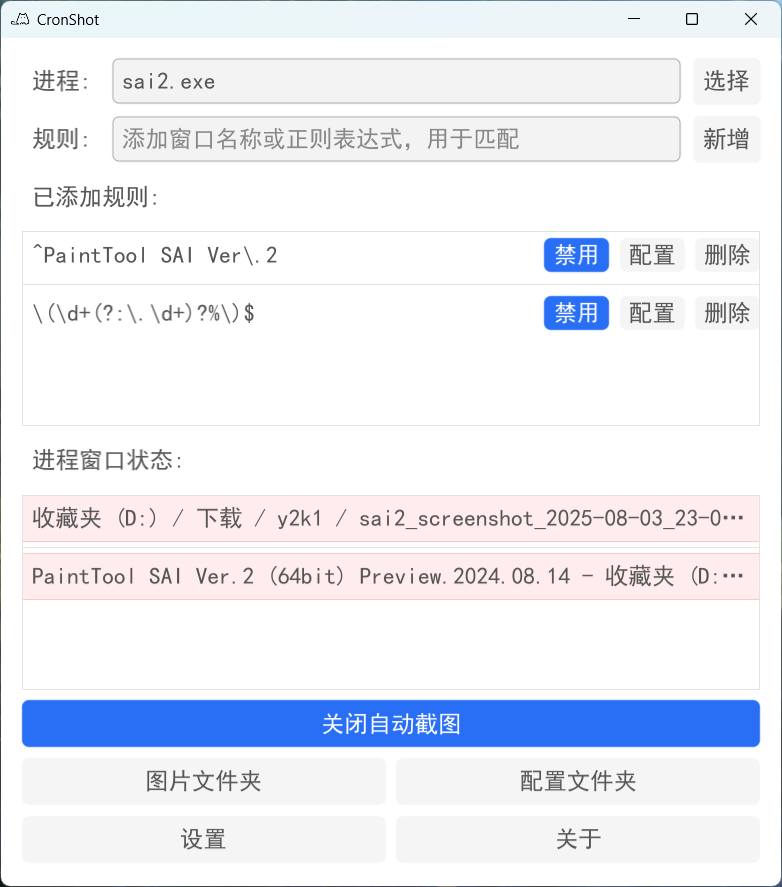
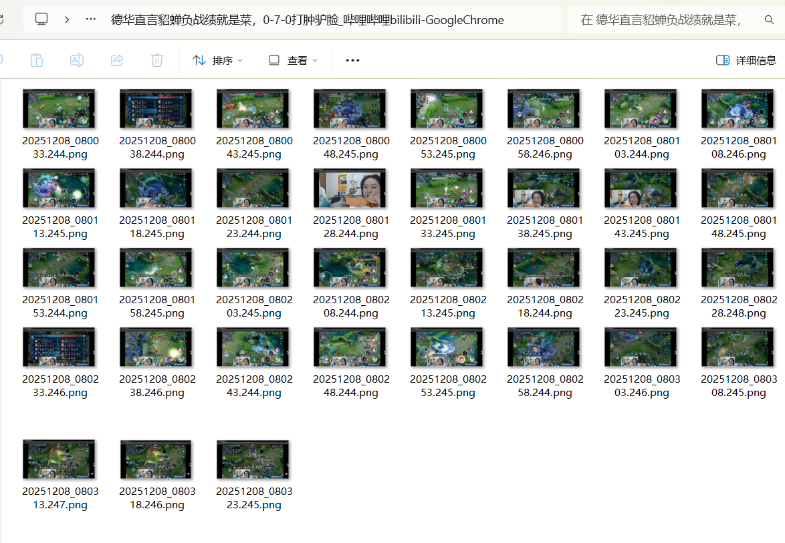

# CronShot

Windows 平台的自动截图工具。按选定进程的窗口周期性截图，并基于规则将图片归档到不同文件夹；支持相同图片去重阈值、系统托盘、静默启动与开机自启。

## 特性

- 进程选择与窗口列表展示，支持搜索与高亮匹配规则
- 规则管理：文本/正则匹配窗口标题、正则捕获组命名文件夹、固定前缀文件夹
- 自动截图循环，周期可配置（秒）
- 相同图片去重：AHash16x16 + 256 位汉明距离，阈值 1–100 可调
- 系统托盘：显示/退出；窗口最小化自动隐藏到托盘
- 启动选项：开机自启、自动开启截图、静默启动到托盘

## 预览
### 界面

### 输出文件

(这里用上敬爱的土鸡作为示例🤪)

## 使用说明

- 在顶部“进程”区域点击“选择”，从列表中挑选需要监控的进程（例如 `chrome.exe`）。
- “进程窗口状态”中展示当前进程的窗口标题，命中规则的项会高亮。
- 点击“设置”进入配置：
  - `存储路径`：选择图片根目录（默认 `图片/CronShot`）
  - `截图周期（秒）`：自动截图的时间间隔
  - `相同图片去重`：开启后，使用阈值避免保存相似图片
  - `重复度阈值（1-100）`：滑块调节，当图片重复度到达阈值时，不进行截图。
  - `开机自启动`、`自动开启截图`、`静默启动`：启动行为控制
- 底部操作：
  - `图片文件夹`：打开当前图片存储根目录
  - `配置文件夹`：打开 `%APPDATA%/CronShot`（包含日志与配置）
  - `设置`、`关于`
- 托盘菜单：
  - `显示`：唤起主窗口
  - `退出`：停止轮询并退出应用

### 规则匹配顺序

- 先进行“全量窗口标题”精确匹配；若未命中，再按“正则规则”匹配。
- 规则列表自上而下，按顺序匹配，靠前的规则优先级更高。

### 注意事项
- 仅对可见窗口进行截图；当窗口不可见（例如最小化）时不会截图。
- 部分界面，可能会有肉眼不可见的变化，可以尝试将阈值调整为99去重。
- 默认存储路径：`图片/CronShot`

## 快速开始

### 环境要求

- Go 1.21+
- Windows 10/11（项目使用 Win32 API 进行窗口枚举与最小化检测）

### 构建与运行

- 开发运行：

  ```bash
  go run .
  ```

- 生成可执行文件：

  ```bash
  go build -ldflags "-H=windowsgui" -o CronShot.exe
  ```

- 发布脚本：见 `build_release.bat`（可进一步优化体积、嵌入图标资源）。

- 


## 去重算法

- 生成 16×16 平均哈希（AHash16x16）得到 256 位特征；
- 计算汉明距离并换算为相似度，若 `相似度×100 ≥ 阈值`，则跳过保存；
- 阈值范围 `1–100`，默认 `100`（较宽松）。

## 目录结构

- `gui/`：界面与交互（主窗口、托盘、选择对话框、规则与状态 UI）
- `config/`：配置读写（含默认路径与持久化）
- `sys_utils/`：Windows 系统相关（窗口枚举、路径、文件夹选择、注册表自启）
- `utils/`：图像哈希、命名与正则工具
- `assets/`：应用图标等静态资源（打包到可执行文件）
- `logging/`：日志初始化与滚动清理

## 致谢

- 图标来源：[Icons8](https://icons8.com/)

## 项目信息

- 版本：v1.0.0
- 作者：YaYa
- 项目地址：https://github.com/YaYaccc/cron-shot

---
